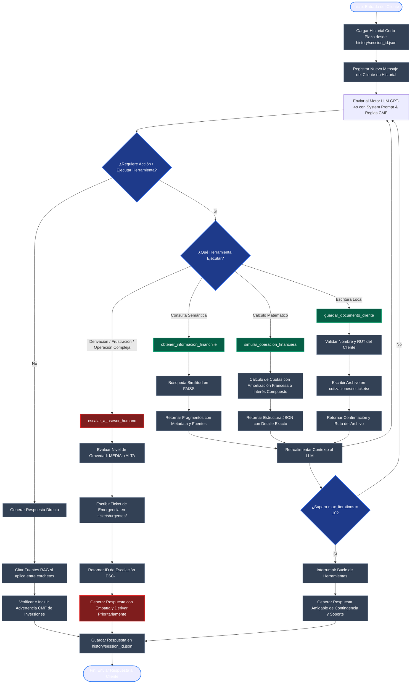

# Diagrama de Orquestación y Flujo - AsesorBot Pro

Este documento contiene la representación visual y la explicación de cómo funciona el flujo de trabajo y la toma de decisiones del agente conversacional **AsesorBot Pro** en **FinanChile Asesorías S.A.**

El diseño del agente se basa en el patrón de arquitectura **ReAct (Reasoning and Acting)**, implementado mediante **LangChain** para controlar la memoria a corto plazo, el acceso a la base de conocimientos y el uso de herramientas en base a la entrada del usuario.

## Diagrama de Flujo en Mermaid

El siguiente diagrama muestra el flujo que sigue el agente cada vez que recibe un mensaje del cliente, evaluando si requiere ejecutar herramientas y aplicando las validaciones correspondientes:

---

## Explicación del Flujo y de las Decisiones del Agente

### 1. Gestión de Memoria e Inicio de Turno
Cada vez que el usuario ingresa un mensaje, el sistema lee el archivo JSON correspondiente a su sesión (`history/{session_id}.json`). De esta forma, recuperamos el historial corto plazo para que el agente recuerde variables previas como el nombre o el RUT del cliente. Esto evita pedir los datos una y otra vez.

### 2. Recuperación Semántica (RAG)
Si la consulta del usuario requiere información sobre políticas o productos financieros, el agente decide usar la herramienta `obtener_informacion_financhile`. Esta herramienta busca en la base de datos de vectores en FAISS y retorna los fragmentos de texto más parecidos. Cada fragmento incluye metadatos indicando la fuente de origen (`[Manual de Productos Financieros]`, `[FAQ FinanChile]`, etc.), lo que permite al agente citar explícitamente de dónde sacó la información.

### 3. Cálculos Deterministas en Backend
Para las simulaciones numéricas de cuotas de créditos o proyecciones de ahorro, el agente invoca `simular_operacion_financiera`. Esta herramienta realiza los cálculos matemáticos directamente en Python utilizando fórmulas estándar de ingeniería financiera (como la amortización francesa de cuota fija). De esta forma se eliminan por completo las alucinaciones matemáticas del LLM.

### 4. Automatización Documental
Cuando el cliente aprueba la propuesta de crédito o solicita soporte formal, el agente ejecuta `guardar_documento_cliente`. Esta herramienta exige que se proporcione el nombre y RUT del cliente antes de registrar la cotización o el caso de soporte en un archivo de texto en local (`cotizaciones/` o `tickets/`), simulando la conexión con el CRM de la empresa.

### 5. Derivación Inteligente a Humanos
El agente evalúa de forma constante el tono y el alcance de las consultas del cliente.
- **Por frustración emocional:** Si el cliente utiliza insultos, se expresa de forma muy molesta o exige de forma insistente un supervisor, el agente invoca autónomamente la herramienta `escalar_a_asesor_humano` con gravedad **alta**.
- **Por operaciones fuera de alcance:** Si se solicitan acciones delicadas o transacciones que exceden las políticas de seguridad (como transferir fondos o cambiar contraseñas), el agente inicia la derivación con gravedad **media**.
En ambos casos se crea un ticket de urgencia en `tickets/urgentes/` con un código único `ESC-...` y se le comunica de forma empática al cliente que su caso fue transferido a una persona experta.
